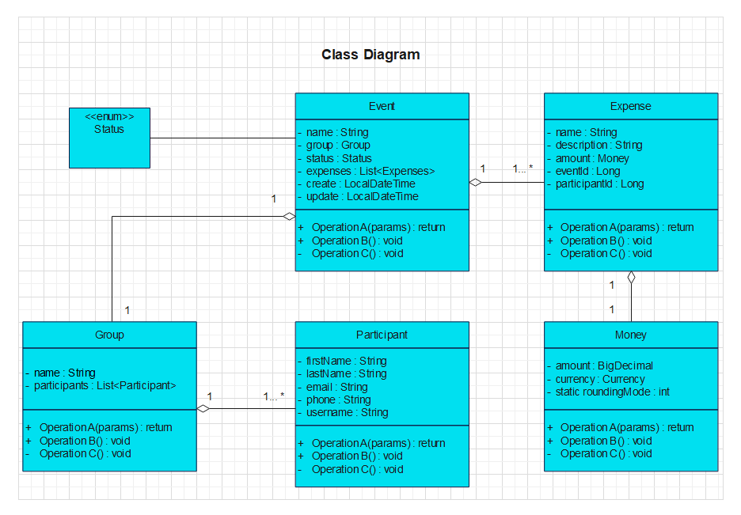

# Shared Expense Calculator

* [General info](#general-info)
* [Requirement](#requirements)
* [API Documentation](#api-documentation)
* [Technologies](#technologies)
* [Conclusion](#conclusion)

## General info:

    This shared-expense-calculator program can be used to calculate the cost share of each person in the group. For example, when you go on a trip with friends, where several people pay for joint expenses. At the end of the trip you will need to calculate how much each person owes and to whom. With this program, you can automate the entire process.

## Requirements:

#### Admin

> * Creates a group of participants
> 
> * Automatically generates a login and password for each participant
> 
> * The admin must be able to create, edit, delete the event and the participant's group

#### Participant

> * The participant must be able to log in

> * The participant has the opportunity to create a new expense, review expenses and balance

#### APP:

> * Balance calculation logic for the event

#### UI:

> * Subpage for group, expenses and balance 

## API Documentation:

| Operation                                        | URL template             |
| ------------------------------------------------ | ------------------------ |
| Get a list of events                             | GET /events              |
| Create a new event                               | POST /events             |
| Get a list of expenses associated with the event | GET /expenses/event/{id} |
| Create a new expenses                            | POST /expenses           |
| Create a new participant                         | POST /participants       |

## Technologies:

* Java 17
* Spring Boot
* Spring Security
* Spring Data
* Spring Scheduler
* Hexagonal Architecture
* Liquibase
* CI/CD
* JUnit 5
* AssertJ
* Mockito
* Lombok
* MySQL
* Docker
* Git

## Conclusion:
